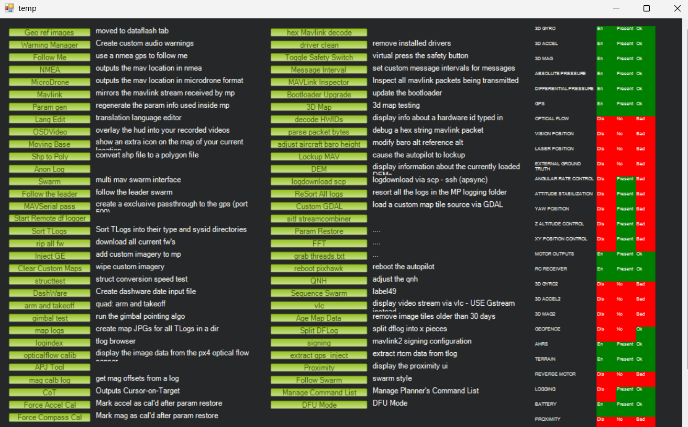
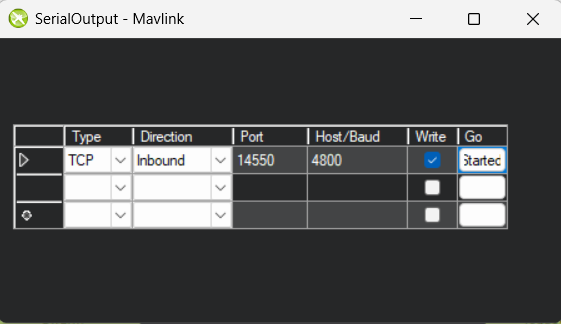

# General Flow:

- cara menjalankan program saat sudah jadi secara general adalah
  - setup mission planner dan run mission
  - set mission planner menjadi tcp host agar dapat terkoneksi dengan backend
  - jalankan backend
  - jalankan frontend

# Setup Backend

1. Clone repo ini
2. Jalankan `python -m venv venv` lalu install libraries dengan `pip install -r requirements.txt`
3. Ubah hal berikut di package dronekit `venv/Lib/site-packages/dronekit/__init__.py`,

- tambahkan kode berikut di line 38

```py
import sys
if sys.version_info.major == 3 and sys.version_info.minor >=  10:
    from collections.abc import MutableMapping
else:
    from collections import MutableMapping
```

- lalu ubah di file yang sama sekitar line 2694, dari

```py
class Parameters(collections.MutableMapping, HasObservers)
```

menjadi

```py
class Parameters(MutableMapping, HasObservers)
```

selesai, selamat ngoding backend!

# Setup Mission Planner

Buka mission planner dan connect ke plane seperti biasanya

Lalu ctrl+f dan pilih mavlink, terdapat di kolom paling kiri urutan ke 6 dari atas



Setelah itu set sebagai berikut


Setelah semuanya telah disetup, bisa langsung jalankan backend dan setelah itu buka frontend

# Extension di VSCode untuk mempermudah pengerjaan

### Thunder Client


untuk memudahkan saat mendevelop api / server. Kita bisa testing endpoint yang sudah kita buat langsung di vscode dengan menggunakan thunder client

# Referensi
- https://ardupilot.org/dev/docs/mavlink-commands.html
- https://mavlink.io/en/messages/common.html
- https://dronekit-python.readthedocs.io/en/latest/
- https://ardupilot.org/plane/docs/parameters.html
- https://ardupilot.org/plane/docs/flight-modes.html
- https://dronekit-python.readthedocs.io/en/latest/guide/auto_mode.html#mission-command-overview